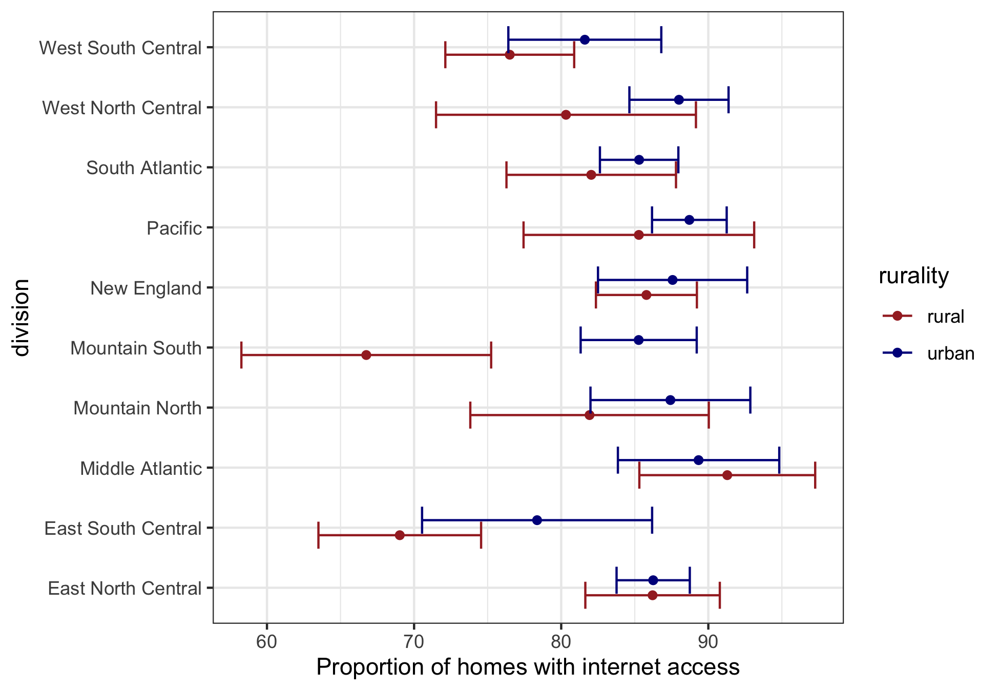
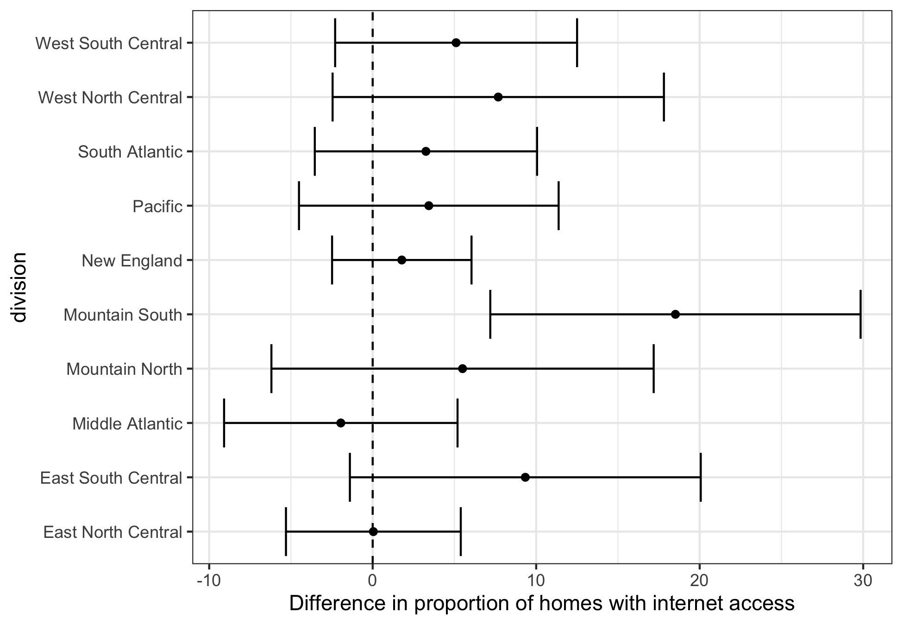

## About
### Week 1: Linux Shell Activities
Jialun Li: https://github.com/CataphractLi/Stats506_public

Yawen Hu: https://github.com/yawenh/Stats506_public

Zhilin He: https://github.com/zhilinheobv/Stats506_public

week1.sh: a script written by our group during the activity.

cutnames.sh: an example script written by the professor as a solution to the activity.

### Week 4-7: Case Studies

Zhilin He: https://github.com/zhilinheobv/Stats506_public

Yan Chen: https://github.com/yanchannn/Stats506_public

Tianshi Wang: https://github.com/SkyWang0919/Stats506_public

Hao He: https://github.com/hhaohe513/Stats506_public

week4_part1.Rmd: The script written in part 1 of week 4 activity.

week4_part1.html: The resulting html file.

In week 5, we made 2 plots about RECS data using ggplot.

in week 6, we cleaned the datasets and created tables.

In week 7, we wrote functions and grouped the data using dplyr.

### Week 8: Group Project

Zhilin He: https://github.com/zhilinheobv/Stats506_public

Jialun Li: https://github.com/CataphractLi/Stats506_public

Chuwen Li: https://github.com/lixx4228/Stats506_public

Group Project link: https://github.com/zhilinheobv/group3_project